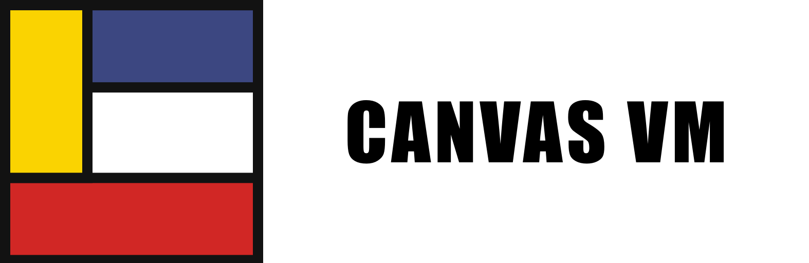

<div align="center">
  
  <br/>
  <p>A serious virtual machine and JIT compiler for the Piet esoteric programming language. Transform images into executable code with bytecode compilation, WebAssembly JIT, and debugging support.</p>

  <p>
    
    
    
  </p>
</div>

## What is Piet?

[Piet](https://www.dangermouse.net/esoteric/piet.html) is an esoteric programming language where programs are images. Code execution flows through colored blocks, with operations determined by color transitions. Canvas VM brings this visual language to life with a modern, performant runtime.

## Features

### Core VM

| Feature | Description |
|---------|-------------|
| **Bytecode Compilation** | Images are compiled to optimized bytecode before execution |
| **Stack Machine** | Full implementation of Piet's stack-based operations |
| **17 Operations** | Complete Piet instruction set support |
| **Watchdog System** | Configurable execution limits to prevent infinite loops |
| **Rich Error Handling** | Detailed error messages with position tracking |

### Debugger

| Feature | Description |
|---------|-------------|
| **Step-by-step Execution** | Execute one instruction at a time |
| **State Snapshots** | Capture and inspect VM state at any point |
| **Execution Traces** | Full history of executed instructions |
| **Visual Debugging** | Track DP (Direction Pointer) and CC (Codel Chooser) |
| **Breakpoints** | Pause execution at specific points |

### WebAssembly

| Feature | Description |
|---------|-------------|
| **Browser Runtime** | Run Piet programs directly in the browser |
| **Interactive IDE** | Visual editor with real-time execution |
| **Input Modal** | GUI for program input (InChar/InNumber) |
| **Configurable Watchdog** | Prevent browser hangs with step limits |

## Architecture

Canvas VM provides **two execution paths** optimized for different use cases:

```
┌─────────────────────────────────────────────────────────────────────────────┐
│                              Canvas VM                                       │
├─────────────────────────────────────────────────────────────────────────────┤
│                                                                              │
│  ┌─────────┐    ┌──────────┐    ┌─────────────┐                             │
│  │  Image  │───▶│ Compiler │───▶│  Bytecode   │                             │
│  │(BMP/PNG)│    │          │    │  Program    │                             │
│  └─────────┘    └──────────┘    └──────┬──────┘                             │
│                                        │                                     │
│                    ┌───────────────────┴───────────────────┐                │
│                    │                                       │                │
│                    ▼                                       ▼                │
│  ┌─────────────────────────────────┐    ┌─────────────────────────────────┐ │
│  │      FAST PATH (Canvas)       │    │     DEBUG PATH (Debugger)     │ │
│  ├─────────────────────────────────┤    ├─────────────────────────────────┤ │
│  │                                 │    │                                 │ │
│  │  ┌───────────┐                  │    │  ┌───────────┐  ┌───────────┐  │ │
│  │  │BytecodeVm │──▶ Output        │    │  │ Debugger  │──│ Snapshots │  │ │
│  │  │ (Direct)  │                  │    │  │ (Stepper) │  │  (State)  │  │ │
│  │  └───────────┘                  │    │  └─────┬─────┘  └───────────┘  │ │
│  │       │                         │    │        │                       │ │
│  │       ▼                         │    │        ▼                       │ │
│  │  ┌───────────┐                  │    │  ┌───────────┐  ┌───────────┐  │ │
│  │  │ Watchdog  │                  │    │  │BytecodeVm │──│  Traces   │  │ │
│  │  │ (Timeout) │                  │    │  │(Wrapped)  │  │ (History) │  │ │
│  │  └───────────┘                  │    │  └───────────┘  └───────────┘  │ │
│  │                                 │    │                                 │ │
│  │  • run() - Full execution       │    │  • step() - Single instruction  │ │
│  │  • run_limited() - With limit   │    │  • get_state() - Current state  │ │
│  │  • Minimal overhead             │    │  • get_trace() - Full history   │ │
│  │  • No state history             │    │  • Rich debugging info          │ │
│  └─────────────────────────────────┘    └─────────────────────────────────┘ │
│                                                                              │
└─────────────────────────────────────────────────────────────────────────────┘
```

### Execution Modes

| Mode | WASM Class | Use Case | Execution |
|------|------------|----------|-----------|
| **Fast** | `Canvas` | Production, benchmarks | **Native WASM** - Bytecode compiled to WASM instructions |
| **Debug** | `PietDebugger` | Development, learning | Interpreted with state tracking |

### Fast Path (`Canvas`) - Native Execution

The fast path compiles Piet bytecode directly to **WebAssembly instructions**, achieving near-native performance:

```
Piet Image → Bytecode → WASM Instructions → Native Execution
```

- **No interpreter overhead** - Operations execute as native WASM opcodes
- **Direct memory access** - Stack operations use WASM linear memory
- **Predictable performance** - Consistent execution speed

```javascript
// Direct execution - maximum performance
const canvas = new Canvas();
canvas.paint(imageData, width, height);
canvas.set_max_steps(100000);  // Watchdog
const result = canvas.run();   // Runs at native speed
console.log(canvas.ink_string());
```

### Debug Path (`PietDebugger`) - Interpreted

The debug path wraps execution with state inspection capabilities:

```javascript
// Step-by-step with full state inspection
const debugger = new PietDebugger();
debugger.load(imageData, width, height);

while (!debugger.is_halted()) {
    debugger.step();
    const state = debugger.get_state();
    console.log(`Step ${state.steps}: ${state.current_instruction.opcode}`);
    console.log(`Stack: [${state.stack.join(', ')}]`);
}
```

## Piet Operations

Canvas VM implements the complete Piet specification:

### Stack Operations
| Op | Description |
|----|-------------|
| `push` | Push block size onto stack |
| `pop` | Discard top of stack |
| `duplicate` | Copy top of stack |
| `roll` | Roll stack elements |

### Arithmetic
| Op | Description |
|----|-------------|
| `add` | a + b |
| `subtract` | a - b |
| `multiply` | a × b |
| `divide` | a ÷ b (integer) |
| `mod` | a mod b |

### Logic
| Op | Description |
|----|-------------|
| `not` | 0 → 1, else → 0 |
| `greater` | a > b → 1, else → 0 |

### Control Flow
| Op | Description |
|----|-------------|
| `pointer` | Rotate DP clockwise n times |
| `switch` | Toggle CC if n is odd |

### I/O
| Op | Description |
|----|-------------|
| `in(number)` | Read integer from input |
| `in(char)` | Read character from input |
| `out(number)` | Output integer |
| `out(char)` | Output character (ASCII) |

### Operation Table

Operations are determined by hue change (columns) and lightness change (rows):

|  | Δhue=0 | Δhue=1 | Δhue=2 | Δhue=3 | Δhue=4 | Δhue=5 |
|--|--------|--------|--------|--------|--------|--------|
| **Δlight=0** | nop | push | pop | add | subtract | multiply |
| **Δlight=1** | divide | mod | not | greater | pointer | switch |
| **Δlight=2** | duplicate | roll | in(num) | in(char) | out(num) | out(char) |

## Color Palette

Canvas VM supports all 20 Piet colors:

| Hue | Light | Normal | Dark |
|-----|-------|--------|------|
| Red | `#FFC0C0` | `#FF0000` | `#C00000` |
| Yellow | `#FFFFC0` | `#FFFF00` | `#C0C000` |
| Green | `#C0FFC0` | `#00FF00` | `#00C000` |
| Cyan | `#C0FFFF` | `#00FFFF` | `#00C0C0` |
| Blue | `#C0C0FF` | `#0000FF` | `#0000C0` |
| Magenta | `#FFC0FF` | `#FF00FF` | `#C000C0` |

Plus special colors:
- **White** `#FFFFFF` - Free passage, no operation
- **Black** `#000000` - Blocked, causes direction change

## Watchdog System

Prevent infinite loops and runaway programs:

```rust
// Rust API
let mut vm = BytecodeVm::from_grid(grid)?;
vm.set_max_steps(Some(100_000));  // Limit to 100K steps
vm.run()?;  // Will error with ExecutionTimeout if exceeded

// Disable watchdog
vm.disable_watchdog();
```

### Configurable Limits (Web IDE)

| Setting | Steps | Use Case |
|---------|-------|----------|
| 1K | 1,000 | Quick tests |
| 10K | 10,000 | Small programs |
| **100K** | 100,000 | Default |
| 1M | 1,000,000 | Complex programs |
| ∞ | Unlimited | No limit (caution!) |

## Quick Start

### Web IDE

Visit the [Canvas VM Playground](https://joelibaceta.github.io/CanvasVM/) to run Piet programs in your browser.

1. Upload a `.bmp` or `.png` Piet image
2. Click Play or Run Fast
3. Use Step for debugging
4. Watch the stack and output in real-time

### Rust Library

```rust
use canvas_vm::{BytecodeVm, Grid};

// Load image and create grid
let grid = Grid::from_image("hello.bmp", 1)?;

// Create VM and run
let mut vm = BytecodeVm::from_grid(grid)?;
vm.run()?;

// Get output
println!("{}", vm.output_string());
```

### CLI (Coming Soon)

```bash
canvas-vm run hello.bmp
canvas-vm debug hello.bmp --step
canvas-vm compile hello.bmp -o hello.pbc
```

## Crate Structure

```
canvas_vm/
├── crates/
│   ├── canvas_vm/      # Core VM implementation
│   │   ├── vm.rs       # Bytecode VM executor
│   │   ├── compiler.rs # Image → Bytecode compiler
│   │   ├── bytecode.rs # Instruction definitions
│   │   ├── grid.rs     # Image/codel grid
│   │   ├── ops.rs      # Piet operations
│   │   ├── debugger.rs # Step debugger
│   │   └── error.rs    # Error types
│   ├── canvas_wasm/    # WebAssembly bindings
│   └── canvas_codec/   # Image format support
├── docs/               # Web IDE
└── tools/              # Development utilities
```

## Bytecode Format

Instructions are compiled to an efficient intermediate representation:

```rust
pub enum Instruction {
    Push(i32),    // Push literal value
    Pop,          // Remove top of stack
    Add,          // Arithmetic operations
    Subtract,
    Multiply,
    Divide,
    Mod,
    Not,          // Logic
    Greater,
    Pointer,      // Control flow
    Switch,
    Duplicate,    // Stack manipulation
    Roll,
    InNumber,     // I/O
    InChar,
    OutNumber,
    OutChar,
    Nop,          // No operation
    Halt,         // Stop execution
}
```

Each instruction includes optional debug info:
- Source position (x, y)
- Direction Pointer state
- Codel Chooser state
- Block size and colors

## Error Handling

```rust
pub enum VmError {
    InvalidColor(u8, u8, u8),  // Unknown RGB color
    DivisionByZero,            // Divide/mod by zero
    EmptyStack,                // Pop from empty stack
    StackUnderflow,            // Insufficient operands
    InvalidInput,              // Bad input format
    OutOfBounds,               // Position outside grid
    Halted,                    // VM already stopped
    ExecutionTimeout(usize),   // Watchdog triggered
}
```

## Testing

```bash
# Run all tests
cargo test

# Run VM tests specifically
cargo test -p canvas_vm

# Run with output
cargo test -- --nocapture
```

## Building

### Prerequisites
- Rust 1.70+
- wasm-pack (for WASM build)

### Native Build
```bash
cargo build --release
```

### WASM Build
```bash
wasm-pack build crates/canvas_wasm --target web --out-dir ../../docs/pkg
```

## License

MIT License - See [LICENSE](LICENSE) for details.

## Acknowledgments

- [David Morgan-Mar](https://www.dangermouse.net/esoteric/piet.html) - Creator of Piet
- [Piet Mondrian](https://en.wikipedia.org/wiki/Piet_Mondrian) - Artistic inspiration
- The esoteric programming community

---

<p align="center">
  <strong>Canvas VM</strong> - Where art becomes code
</p>
